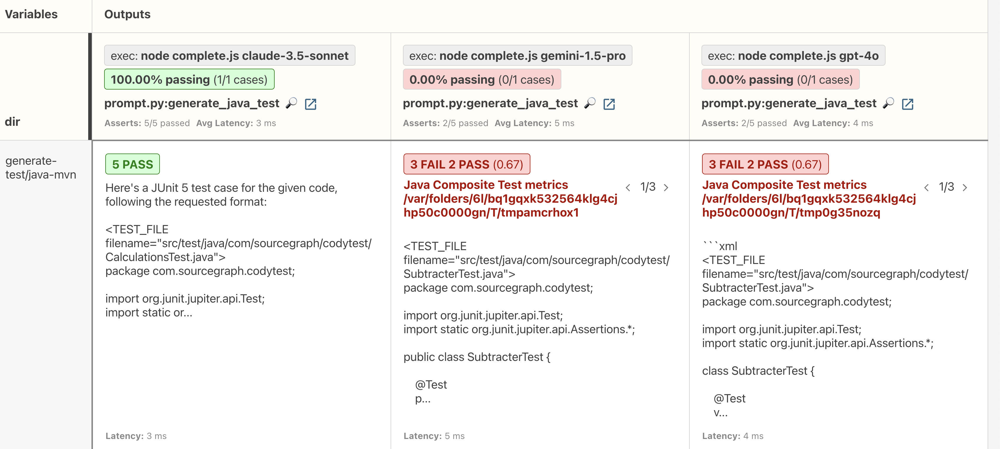
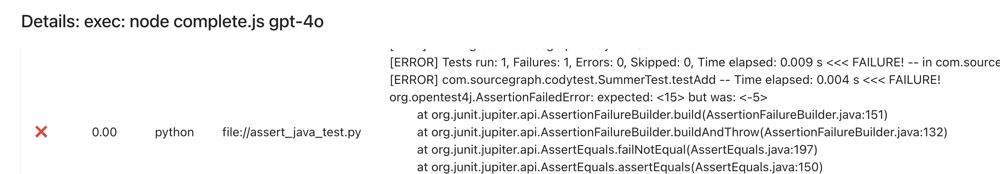

# Evaluating Cody prompts with Promptfoo

This directory includes an example of how to use [Promptfoo](https://promptfoo.dev)
together with Cody to evaluate the quality and correctness of Cody's responses.

## Quick start
First, name sure you have `pnpm` installed:
```bash
brew install node
npm install -g pnpm
pnpm install
```

To get started, first configure the `SRC_ENDPOINT` and `SRC_ACCESS_TOKEN` environment variables to
authenticate with your Sourcegraph instance:
```bash
export SRC_ENDPOINT=https://sourcegraph.com
export SRC_ACCESS_TOKEN=sgd_TOKEN
```

Validate that you can successfully authenticate with your Sourcegraph instance:
```bash
pnpm dlx @sourcegraph/src login
```

Next, run the "hello world" Promptfoo example, which compares the output of
Sonnet 3.5, Gemini Pro, and GPT-4o on a basic coding challenge:

```bash
pnpm exec promptfoo eval --config hello-world.yaml
```

Finally, review the results by opening a separate terminal
and running:

```bash
pnpm exec promptfoo view --yes
```

## Advanced example - generate Java unit tests

Run the following command to evaluate more complex example
that generates Java unit tests:


```bash
pnpm exec promptfoo eval --config generate-java-test.yaml
```

This example demonstrates how to use Promptfoo assertions
to programmatically evaluate the generated output.
See [assert_java_test.py](./assert_java_test.py) to see how
we automatically write the LLM output to a Java Maven project,
and evaluate the quality of the output by compiling the code,
running the tests, and running mutation testing coverage.

In this example, we see that Sonnet 3.5 is the only model
that gets a full score. The other models produce tests
that compile succesfully, but have failing assertions:





## Learn more

The [Promptfoo website](https://promptfoo.dev) has more
documentation about how to use Promptfoo.
